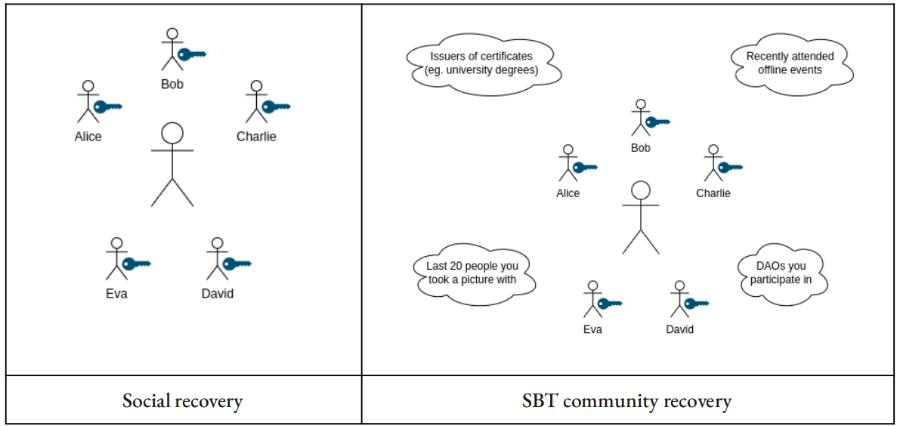
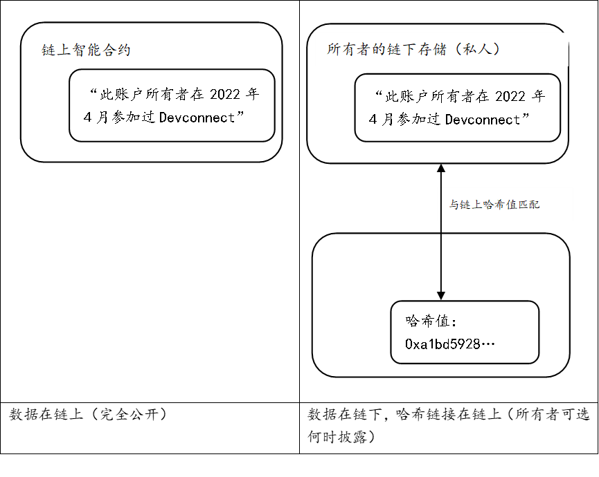

	<a target="_blank" href="https://github.com/EthereumCN/Decentralized-Society/blob/main/%E5%8E%BB%E4%B8%AD%E5%BF%83%E5%8C%96%E7%A4%BE%E4%BC%9A%EF%BC%9A%E5%AF%BB%E6%89%BEWeb3%E7%9A%84%E7%81%B5%E9%AD%82.pdf">Download</a>

来源：https://papers.ssrn.com/sol3/papers.cfm?abstract_id=4105763

作者 | E.格伦·韦尔[2]，普迦·奥尔哈弗[3]，维塔利克·布特林[4]

翻译 | @如我   @绵绵 Maggie   @Survivor   @Austin   @chainbase  

校对 | ECN

 

道（DAO）者万物之奥。善人之宝，不善人之所保。

——老子, 62 章

 

# 摘要

 今天的 Web3 主要表现在可转让的金融化资产上，而不是对社会信任关系的编码。然而，很多核心的经济活动是建立在持久且不可转让的关系上的，如无抵押贷款和个人品牌建设。在本文，我们阐述了：代表了“灵魂”中承诺、凭证、归属关系的不可转让的“灵魂绑定”通证（下文称“SBTs”），如何对实体经济的信任网络进行编码，从而确立出处与建立声誉。更重要的是，SBT 为其他拥有远大抱负的应用赋能，比如社区钱包恢复、对抗女巫攻击的治理，去中心化的机制，和具有可分解性、共享性权利的新型市场。我们把这种更丰富、更多元化的的生态系统称为“去中心化社会”（Decentralized Society, DeSoc）——它具备共同做决定的社会性。在这个系统中，灵魂跟社区可以自下而上召集起来，作为彼此的新兴属性，以在一定的范围内共同创造多元的网络物品和网络智能。这种社会性的关键在于可分解的产权和强化的治理机制，通过奖励合作和信任，同时保护网络不被俘虏、寻租和控制，例如对相关性分数降低权重的二次方融资。有了这种强化的社会性，Web3可以避免现在的超级金融化趋势，并支持一个更具有变革性、多元化，跨越社交距离且收益递增的未来。

 

# 1.介绍

Web3 在不到十年的时间内打造了一个具有前所未有的灵活性和创造力的平行金融系统，惊艳了全世界。密码学和经济学原语，如公钥密码学、智能合约、工作量证明和权益证明等，带来了一个复杂而开放的金融交易生态系统。

然而，金融交易的经济价值是产生于人类及其关系的。由于 Web3 缺乏代表这种社会身份的原语，它从根本上还是依赖于非常中心化的 Web2 结构，它希望超越这种结构，却同时在重蹈其局限性。

这种依赖性的例子包括：

1. 大多数 NFT 艺术家都依赖于像 OpenSea 和推特这样的中心化平台来提供稀缺性和最初原创性的保证。

2. 尝试超越简单的通证投票模式的 DAO 通常依赖于一些 web2 基础设施 (如社交媒体资料) 以抵御女巫攻击。

3. 许多 web3 参与者依赖于像 Coinbase 或 Binance 等中心化实体管理的托管钱包。去中心化的**密钥管理系统**对任何人来说都不是用户友好型的，而最为复杂。

此外，原生 web3 身份的缺乏，导致如今的 DeFi 生态系统无法支持现实经济中再平凡不过的活动，例如**抵押不足的贷款 (undercollateralized lending)** 或像公寓租赁这样的简单合同。在这篇论文里，我们阐述了，即使是用灵魂绑定通证代表社会身份的微小进展，也能克服这些局限，通过在原生的 Web3 环境中的基础人类关系把这个生态系统推向更接近于再生市场的形态。

更值得憧憬的是，我们重点论述具有丰富社会关系可组合性的原生 web3 社会身份，将如何在解决 web3 中围绕财富集中和治理易受金融攻击等更广泛的长期问题上取得巨大进展，同时刺激具有创新性的政治、经济和社会层面应用的寒武纪大爆炸。我们将这些用例和它们促成的更加丰富多元的生态系统统称为**“去中心化社会”（下文称“DeSoc”）**。

 

# 2.概览

首先，我们会解释 DeSoc 的原语，其核心是存放**不可转让的（初期为公开的）“灵魂绑定通证**”的账户（或钱包），这些 SBT 代表承诺、凭证和归属关系，这样的通证就像一份延展版的简历，由证明这些社会关系的其他钱包出具。

然后，关于通往在这个社会堆栈上实现越发具有雄心的应用的“阶梯”，我们对这些原语所赋能的进行了描述，它们包括：

●确立出处

●通过声誉打开抵押不足的贷款市场

●实现去中心化的密钥管理

●阻碍和抵消协同的策略性行为

●度量去中心化的程度

●创建具有可分解性的、共享的权利和权限的新式市场

这一描述最终形成 DeSoc 的愿景——共同做决定的社会性。在这个社会里，灵魂跟社区可以自下而上聚集在一起，作为彼此的新兴属性，以在一定的社会规模内，共同创造多元的网络物品，其中包括多元智能。最后，我们回应了几个潜在疑虑和反对意见，并与web3中其他为人熟知的身份范式进行了比较，尽管经常说我们的愿景 DeSoc 的初级版本，但却是可编程隐私和通信的进步。然后，我们考虑通过技术途径来开启实现我们设想的愿景的道路。在这些基础上，通过更多的哲学式思辨，我们期待 DeSoc 可以将 web3 重定向到一条更深刻、更具有认受性和更具变革性的康庄大道上。

 

# 3.灵魂

我们的关键原语是持有**公开可见的、不可转让的（但可能是发放者可撤销的）token** 的账户或钱包。[5] 我们将这些账户称为“灵魂 (souls)”，并将这些账户所持有的token称为“[灵魂绑定](https://vitalik.ca/general/2022/01/26/soulbound.html)通证”(SBTs)。尽管我们十分关注隐私但我们最初假设它们是公开的，因为技术上它更容易进行概念证明，即使人们愿意公开分享的通证类别有限。在本文的后面，我们将用更丰富的用例引入“可编程隐私”的概念。

想象一下这样的一个世界，大多数参与者都有灵魂，它存储了一系列与 SBT 相对应的归属关系、成员资格跟凭证。例如，一个人可能有一个灵魂，它存储了代表教育证书、就业历史、或他们的写作或者艺术作品的哈希的 SBT 。在最简单的形式下，这些 SBT 可以被“自我核证”，就像我们在简历中分享自己的信息一般。但是，当一个灵魂所持有的 SBT 可以被其他对手方的灵魂账户发放或者证明时，这种机制真正的威力就出现了。这些对手方灵魂账户可以是个人、公司或机构。例如，以太坊基金会可以是向参加开发者会议的灵魂发放 SBT 的灵魂账户，一所大学可以是向毕业生发放 SBT 的灵魂账户，一个体育场可以是向道奇队的长期球迷发放 SBT 的灵魂账户。

值得我们注意的是，没有硬性要求说，一个灵魂需要与一个合法的名称相关联，也没有任何协议级别要求保证“一个人只能有一个灵魂”。一个灵魂可能是一个长时间的佚名，具有一系列没有明显关联的 SBT 。

 

# 4.通往DeSoc的阶梯

## 4.1艺术与灵魂

灵魂是艺术家们把声誉押在作品上的一种自然方式。当发行一个可交易的 NFT 时，一个艺术家可以从他们的灵魂账户中发行 NFT 。艺术家的账户持有的 SBT 越多，买家就越容易确定该账户属于该艺术家，从而也确定了 NFT 的真假。艺术家还可以进一步，发行一个存放在他们灵魂钱包的相关联 SBT，该钱包可以证明该 NFT 是属于一个“作品集”，由此保证艺术家希望设定的任何稀缺性限制。因此，灵魂钱包可以创建一种可验证的链上方式，将声誉押在一个物品的出处和稀缺性上，并由此构建声誉。

SBT 的应用不局限于艺术，而可以延展至服务、租赁与任何以稀缺性、声誉或真实性 (authenticity) 为基础的市场。后者的一个例子是验证声称是事实记录 (如照片或视频) 的真实性。随着深度伪造技术的进步，人工和算法的直接检查将越来越无法检测出真实性 (veracity)。尽管区块链打包使得我们可以追踪一个特定作品的创造时间，SBT 还能使得我们可以追踪其社会性出处 (social provenance)，给我们提供发行这个作品的灵魂账户的丰富社会脉络——它们一系列相关的成员资格、归属关系、凭证——以及它们与该物品的社会距离。“深度伪造物 (deep fakes)" 是可以很容易被辨识出来的，因为那些伪造品在时间和社会脉络上对不上，而可信制品 (像照片) 可以从有声誉的摄影师的证明产生。

目前的技术使文化产品 (如照片) 失去了脉络，并使得它们容易受到不受控制的病毒式攻击，这些攻击缺乏社会脉络，但 SBT 可以把这些东西重新放回到社会脉络里，并利用已经呈现在社区里的信任关系给灵魂账户赋能，以此作为保护声誉的重要背景。

## 4.2 灵魂借贷

直接建立在声誉之上的最大金融价值大概是信贷和无抵押贷款。目前，web3 生态系统不能复制简单形式的无抵押贷款，因为所有的资产是可转让且可出售的——因此只是简单形式的抵押贷款。“传统的”金融生态系统支持多种形式的无抵押贷款，但依赖于中心化的信用评分来衡量借款人的信用度，而这些借款人几乎都是没有动力分享其信用历史相关信息的。但这种评分也有很多缺点。在最好的情况下，他们在暗地里提高或降低信誉相关因素的权重，并歧视那些信誉数据积累不够的人 —— 主要是少数族裔和穷人。在最坏的情况下，他们可以使用《黑镜》中不透明的“社会信用”系统，以密谋策划社会走向和强化歧视。

一个基于 SBT 的生态系统可以开启一种抗审查的、自下而上的替代方案，以替代自上而下的商业和“社会”信贷系统。代表教育证书、工作经历和租赁合同的 SBT 可以作为信用相关历史的持续记录，使得灵魂账户可以在不需要抵押品的情况下用有价值的声誉为贷款担保。贷款和信用额度可以用不可转让但可撤销的 SBT 来代表，所以它们被嵌套在灵魂账户的其他 SBT 中——一种不可没收的声誉担保物——直到它们被偿还并随后被烧毁，或者更好的是，用偿还证明 (proof-of-repayment) 代替。SBT 具备有用的担保属性：不可转让性阻止了未偿贷款的转移或隐藏，同时一个丰富的 SBT 生态系统确保那些试图逃避还款的借款人 (可能通过开设新的灵魂账户) 将会因为缺乏 SBT 而无法有效通过质押其声誉来借款。

利用 SBT 计算公共债务的便利性将有助于开源借贷市场。SBT 和还款风险之间将出现新的相关性，它们可以催生更好的、预测信用度的贷款算法，从而削弱中心化、不透明的信用评分基础设施所起的作用。更好的是，贷款可能发生在社交联系中。特别是，SBT 将为类似穆罕默德·尤努斯（Muhammad Yunus）和格莱珉银行（Grameen Bank）开创的社区贷款实践提供一个基础层，其中的社交网络成员愿意担保彼此的债务。因为一个灵魂账户的 SBT 组合代表了在多个社会团体中的成员身份，参与者可以很容易地发现其他灵魂账户，他们有可能在一个团体借贷项目中成为有价值的共同参与者。商业贷款是一种在还款前“贷了就不管”的模式，而社区贷款则可能采取“贷给你还帮助你”的方式，将营运资本与人力资本结合起来，从而获得更高的回报率。

​    

无抵押社区贷款是如何起步？一开始，我们期望灵魂账户只持有反映他们愿意公开分享的信息的 SBT，比如简历中的信息。虽然范围有限，但这可能是足以启动社区内贷款实验的解决办法，特别是如果 SBT 是由信誉良好的机构发行的话。例如，一组 SBT 代表了某些编程证书、参加过几次会议和工作经历，这可能足以让一个灵魂账户为他们的企业获得贷款（或筹集种子轮的投资）。这些凭证和社会关系，在风险投资等资本配置中已经以非正式的方式暗暗发挥了重要的作用。

## 4.3 小心丢失你的灵魂

具备不可转让性的重要 SBT ，如只颁发一次的教育证书等，引发了一个重要问题：你如何不丢失灵魂？目前的恢复方法，如多签恢复或助记词，在心理接受度、交易便捷性和安全性方面都各有权衡。社交恢复是一种新兴的替代方案，他依赖于一个人的可信任关系。SBT 使一种类似但范围更广的范式成为可能：**社区恢复，其中灵魂是其社交网络的交叉表决。**

社交式恢复是解决安全问题的一个很好的起点，但其在安全性和可用性方面有一些不足。一个用户组织一组“守卫者”，并给他们赋权：大多数的守卫者同意即可改变钱包的私钥。“守卫者”可以是个人、机构和其他钱包的组合。这个方案的问题在于，用户必须在守卫者大多数的意愿与提防不相关社交圈的守卫者之间做平衡，以避免合谋。而且，守卫者可能会离世，关系会变差，或人们可能就不再联系了，因此守卫者的更替需要频繁和大量精力。尽管社交式恢复避免了单点故障，但成功的恢复依赖于与多数守卫者的可信关系的建立和维护。

**一个更强大的解决方案是，将灵魂恢复与灵魂在不同社区的成员身份联系起来，不是组织策划，而是利用尽可能广泛的实时关系来实现安全。**回想一下，SBT 代表不同社区的成员身份。 其中一些社区，如雇主、俱乐部、大学或教堂，实际上可能更偏向链下世界，而其他社区，如参与协议治理或  DAO，可能更偏向链上世界。在社区恢复模型中，恢复一个灵魂的私钥将需要来自灵魂所在多个社区（随机子集）中符合资格的大多数成员中的一个成员的同意。

与社交恢复一样，我们假设灵魂可以访问安全的链下通信通道，其中“身份验证”——通过对话、会面或确认一个共享的秘密——是可以实现的。与链上机器人或 SBT 本身的计算相比，此类通信通道将需要更大的带宽（技术上能够承载更丰富的“信息熵”）。事实上，我们可以认为 SBT 从根本上就是参与或访问这种真正的（即高带宽）通信通道。

让这个方案可行的精确细节还需要实验来确定。例如，如何挑选守卫者以及需要多少名守卫者的同意，都是需要进一步研究的关键安全参数。然而，有了如此丰富的信息库，社区恢复在计算上应该是可能的，随着灵魂加入更多不同的社区并形成更有意义的关系，安全性也会提高。

社区恢复作为一种安全机制，体现了 20 世纪初的社会学家、社会网络理论创始人格奥尔格·齐美尔 (Georg Simmel) 提出对于身份的观点，即个体性是从社会群体的交集中产生的，正如社会群体是作为个体的交集出现的。对灵魂账户的加密财产进行维护和恢复需要灵魂网络的同意。通过在社会性中嵌入安全性，灵魂总是可以通过社区恢复来重新生成他们的密钥，从而威慑灵魂盗窃（或出售）：因为卖家需要证明出售恢复关系，任何出售灵魂的尝试都缺乏可信度。

## 4.4 灵魂空投

我们已经解释了灵魂账户如何能够代表个人，并反映他们的独特性和群体认同，因为它们获得了能反映他们的归属关系、成员资格和证书的 SBT。这种个体化有助于灵魂建立声誉和原创性 (provenance)，进入无抵押的贷款市场，并保护声誉和身份。但反过来，SBT 也给社区赋能，使得社区得以在灵魂间的独特交集中建立起来。到目前为止，web3 在很大程度上依靠代币销售或空投来召集新的社区，而这种做法的准确性和精确性都不高。空投，即通过算法将代币免费送给一组钱包，大多落入现有持币者和钱包中——很容易受到女巫攻击，**鼓励策略性行为和引发马太效应**。SBT 提供了一个全新的改良，我们称之为“灵魂空投 (souldrops)"。

“灵魂空投”是基于对灵魂内的 SBT 和其他代币进行计算的空投。例如，一个 DAO 想要在一个特定的一层协议内组件一个社区，它可以向出席了最近 3/5 场会议并获得其 SBT 或其他出席证明通证（例如POAP）的开发者进行灵魂空投。 协议还可以通过编程对 SBT 组合里的代币空投进行加权。我们可以想象一个情景，一个以种树为使命的非营利组织将治理代币投给持有环保行动 SBT、园艺 SBT 和碳封存代币的灵魂账户，他们可能会给碳封存代币的持有者投更多的治理代币。

灵魂空投还可以引入新的激励来鼓励社区参与。 已经空投的 SBT 可以在一段时间内与灵魂绑定，但最终随着时间的推移“被归为”可转让的代币。反过来也可以，持有一段时间的可转让代币可以解锁 SBT 的权利，从而赋予其对协议进一步的治理权。SBT 为实验最大化社区参与度和其他目标（如去中心化）的机制提供了丰富的可能性，我们将在下面进一步讨论。

## 4.5 灵魂的去中心化自治组织（DAO

去中心化自治组织（DAO）是为了共同的目标聚集在一起的虚拟社区，成员通过在公链上的智能合约进行投票来协作。尽管 DAO 在跨越距离和差异的全球社区协作上有很大的潜力，但它们很容易受到女巫攻击——即一个用户通过多个钱包地址来积累大量投票权，或者在简单一点的一币一票式治理机制中，只需要不断囤积代币来获得 51% 的投票权，以此来剥夺其余 49% 代币持有者的利益。

DAO 可以用 SBT 来降低“女巫攻击”的风险，以下是一些具体操作方法：

- 计算一个灵魂账户的 SBT 组合，**以分辨独一无二的灵魂和可能存在的机器人**，并拒绝对那些有可能是“女巫”的灵魂授予投票权；

- 对那些持有更高声誉的 SBT (例如工作和教育凭证、许可证或证书) 的灵魂账户**授予更多的投票权**。

- 发放专门的"**人格证明 (proof-of-personhood)**" SBT，它们有助于其他 DAO 启动抗女巫攻击。

- 检查支持某项投票的灵魂账户所持有的 SBT 之间的相关性，并对相关性很强的投票者给予较低的投票权重。

后面关于相关性检查的想法格外地具有潜力并且很新颖。当一项投票得到很多有相同 SBT 的灵魂账户支持时，这很可能是一次女巫攻击，即使不是女巫攻击——这样的投票也很可能是一群灵魂账户在做同一个错误判断或他们共享着相同的偏见，因此，在同等数量级别的支持下，他们的投票权重理应低于更为多样化的参与者群体的投票权重。[7]

在附录中，我们用数学方法对这个想法在二次方募资的背景下进行了更详细的探讨，我们引入了一个新原语——“**相关性分数**”。这种因相关性而调低权重的理念可以延展到协商对话的构建。例如，容易受大多数控制的 DAO 可以对 SBT 进行计算，并让尽可能多元的成员参与对话，并确保少数群体的声音能被听到。

DAO 也可以靠 SBT 来阻止一些策略性行为，例如“吸血鬼攻击”。在这种攻击中，一个 DAO (通常与一个 DeFi 协议的经济价值相关联) 通过复制另一个 DAO 的开源代码来剽窃后者的研发成果，并随后使用代币诱惑用户迁移流动性。对于这种攻击，DAO 可以通过一开始创建一个围绕灵魂空投 (可能是股权兑现的 SBT ) 的规范来防止搭便车的人，规定只给抗女巫攻击且提供流动性的灵魂空投，而对那些在吸血鬼攻击中转移了资金的灵魂，则不给予空投。但同样的机制对钱包空投无效，因为持有人可以将流动性分散到不同钱包中，以混淆视听。

DAO 还可以用 SBT 使得领导层和治理架构对社区变化作出程式化的调整。领导角色可以随社区构成的变化而动态变化，社区构成的变化反映在成员灵魂账户中 SBT 分布的变化上。基于在 DAO 内处于多个社区的交叉程度和覆盖范围，一部分成员可能会被提升成为管理员角色。重视社区凝聚力的协议可以使用 SBT 来把交叉性强的灵魂作为社区中心。另外，DAO 可以在治理上尤其重视某些特征的组合，比如重视邮政编码的多样性，或是一个特别爱好的 DAO 小组中的参与度。

## 4.6 用多元性（Pluralism）来度量去中心化程度

在分析现实世界的生态系统时，衡量它的去中心化程度无疑是重要的：该生态系统在多大程度上真正去中心化了？是否可能是伪去中心化——实际上由一个或少数互相配合的实体主导的。

有两个流行的去中心化指标：一个是 Balaji Srinivasan 提出的“中本聪系数（Nakamoto coefficient）“，它用于度量需要多少个不同实体能够收集到 51% 的某类资源；另一个是赫芬达尔-赫希曼指数系数 ( Herndahl-Hirschman index) ，它出于反垄断的目的用以度量市场集中度，计算方法是对市场参与者所占市场份额的平方求和。然而，这些方法依然忽略了一些关键问题，如：什么才是需要度量的正确资源？如何处理部分协同？以及什么构成“不同实体”的灰色地带。

例如，名义上彼此独立的公司可能有共同的大股东，董事之间可能是朋友关系，或由同一个政府监管。在代币协议的背景下，通过链上钱包地址来衡量代币持有情况的去中心化程度是很不准确的，因为一人持有多个钱包已经很普遍，而一些钱包地址（如交易所）则代表着一大群人。此外，即便钱包地址可以追溯到唯一的个体，这些社会相关群体可能出现意外的协作 (最好的情况) 或故意合谋 (最坏的情况)。**度量去中心化的一个更好方式，应当是描绘出社会依赖关系、弱的归属关系和强的团结关系。**

图中的矿工和矿池运营商们总共控制着比特币总算力的 90% ，而他们一起出席会议。

SBT 支持一种可以度量 DAO、协议或网络的去中心化（或多元性）程度的全新方法。

- 第一步，协议可以把代币投票权限制在那些合乎逻辑的、非女巫攻击 (或有丰富的 SBT ) 的灵魂账户。

- 第二步，协议可以检查不同灵魂持有的 SBT 之间的相关性，如果它们共享大量 SBT ，则对它们的投票权进行降低权重处理（将它们合并，仅作部分区分）。(附录 A，我们用数学方法在二次方募资的背景下就降低权重这个想法进行了更详细的探讨，我们引入了一个新原语，称为“相关性分数”）；

- 第三步，为了更加全面地了解整个网络的去中心化程度，我们可以度量灵魂所持有的 SBT 在不同的网络堆栈层级之间的相关性——测量投票、代币所有权、治理相关的交流、甚至对计算资源的掌控之间的相关性。

SBT 使我们得以开始测量一个充满互操作性和多层级生态系统的去中心化程度，这在今天是非常难以进行的。但仍然有一个很大且开放的问题，就是用什么数学公式能够最好地表达我们想要测量的东西，且最不容易被操控？还有很多关于如何测量 SBT 间关系的问题——比如某些 SBT 获得更多的权重，对嵌套的 SBT 降低权重，或将可转让的代币算入到灵魂账户里。但是，在一个灵魂和 SBT 丰富的生态里，会有更多的数据来进行这些计算，并朝着有意义的去中心化方向发展。

## 4.7 多元化资产

DAO 通常拥有部分资产，或因为拥有某些资产而组织起来，包括虚拟和现实世界资产。目前为止，Web3 世界主要局限于一小类资产，即那些“权利束 (bundle of rights)”可完全转让的资产：代币、NFT、艺术品、初版作品或像美国宪法这样的稀有手稿。但对可转让性的强调已经成为 web3 的一个弊端了，使得它不能代表和支持现在一些最简单和普遍的财产合同，例如公寓租赁合同。在罗马法律传统里，产权被定义为使用 ("usus")，耗损或破坏 ("abusus")，和收益 ("fructus") 这些权利束。所有这些权利很少共同被授予同一个所有者。例如，公寓租赁合同授予出租人有限的使用权 ("usus")，但并未授予破坏公寓的权利、出售的权利、或甚至转让使用权 (转租)。不动产 (土地) 的权利通常受制于一系列对私人使用的限制、对公共使用权的授予、对销售权的限制，甚至因国家征用而限制了购买权。它们通常还被抵押，将一些金融价值转移给贷款人。

未来的财产创新不太可能建立在迄今为止想象的 web3 世界里的完全可转让的私有财产上。相反，创新应该取决于把财产权分解的能力，以与现有的财产体系特点相匹配，甚至对更详细的内容进行编码。公司和其他组织形式的演化正是为了以更创新性的方式重新配置产权——例如，允许雇员使用专有设施 ("usus")，但保留管理人员对资产的变更和破坏权 ("abusus")，同时向股东支付大部分的经济利益 ("fructus")。SBT 具有代表和扩散物理和虚拟资产的这种细微差别的灵活性，同时给新的实验提供灵感。以下是几个用例：

\- 私人或公共资源的访问权限（例如，住宅、汽车、博物馆、公园和虚拟等价物）。可转让的 NFT 不能很好地应用于这个情形，因为访问权通常具有条件性且不可转让：如果我信任你，同意让你进入我家后院并在里面玩乐，这并不意味着我同意你将这个许可再授权给其他人。

\- 数据合作社，SBT 向研究人员授予数据访问权，同时把成员权利实例化为赋予访问权限 (可能通过二次方投票)，以及获得研究中产生的发现和知识产权的经济利益的议价权。我们将在第 5 章<多元意义构建>（Plural Sensemaking）中进一步探讨这个问题。

\- 用当地货币做实验，规定在某个特定地区或属于某个特定社区的灵魂账户如果持有或使用这些货币，这些货币会更高价值。

\- 在参与方面的实验，SBT 为有较少背景信息的灵魂账户 (如移民、青少年) 创造了一个连续基础，以在新的和更广的网络里获得影响力。这样的灵魂会以有限的 SBT 开始，这些 SBT 把他们与家庭和当地社区归集在一起。随着他们的社会联系逐渐多样化，他们会获得更广泛的 SBT，这些 SBT 可以实例化为投票权，以影响更广的网络——这与丹妮尔·艾伦 (Daniell Allen) 的多元政治思想一致——这个过程目前受到任意年龄和居住地划分的影响。

\- 在市场设计实验方面，如在哈伯格税收（Harberger taxation）和 SALSA（self-assessed licenses sold at auction，在拍卖中出售的自评许可证）中，资产持有人会发布一个自评价格，其他人均可从他这里购买资产，且必须定期支付与自评价格成比例的税金，以维持对资产的控制权。SBT 可以用来创造有更多细节的 SALSA 版本——例如，社区批准参与权，以尽量减少来自社区内部或外部的策略性行为。

\- 在民主机制设计实验方面，例如二次方投票。社区里持有代表成员身份的 SBT 即可对例如激励和税率等参数进行二次方投票。归根结底，“市场”和“政治”并非相互独立的设计空间，在探索这两个领域间整个空间的技术栈上，SBT 可以发挥重要作用。通过二次方募资提供公共物品是另一个交叉点。

当然，还需要考虑一些反乌托邦场景。例如，移民系统可以用移民的 SBT 来批准。监管俘虏 (regulatory capture) 可以被编码在嵌套的社区代币里，例如房主拥有不当比例的投票权并故意拖慢住房建设。SBT 可以自动化歧视性的红线政策 (red-lining)。正如我们在后文进一步的讨论，在当前这样不透明的、自上而下需要许可和充满歧视的背景下，这些情况都是需要被考虑的。SBT 会使歧视更加透明，因此可能会更容易引起异议。

## 4.8 从私人和公共物品到多元化的网络物品

更普遍来说，SBT 可以让我们有效地代表和管理在完全私人和完全公共这个光谱上的资产和物品。在现实里，在这个光谱上的几乎所有东西，即使是个人消费品都会有正面的溢出效应，例如让消费者可以更好地对他们的家庭和社区做贡献，以及甚至最全球可用的公共物品 (例如，气候) 都不可避免地使一些地区的人更获益，而有些地区的人则不然 (例如，塞舌尔 v. 西伯利亚)。同样，人类的动机几乎很少是完全自私或完全利他的；有很多早已存在的合作模式，有些在某些社区还盛行着，而在其他社区则不然。

然而，今天的机制设计假设了人都是原子化、自私，且没有预先存在的合作的，这些机制往往无法处理那些早已有合作关系的团体，最好的情况是无恶意的过度协作 [8]，最坏的情况是蓄意合谋。因此，即使是最好的公共募资模型，包括二次方募资 (Quadratic Funding, QF) 也无法广泛使用。QF 通过减少对少数人集中行动的奖励，但增加对多数人集体行动的奖励来鼓励协作；例如，10 个人共同捐了 1 美元能匹配到 99 美元，总共获得 100 美元的资助，而由一个人捐出的 10 美元则得不到匹配资金。在数学上，这是由使资金按比例与个人捐款平方根之和的平方相匹配来实现的 (我们在附录中进一步阐述)。但即使是在大群体 (例如中国的大多数居民) 里的弱合作 (例如对某项事业捐赠 1 美元) 也能控制这个系统，并吸取其所有的匹配资金，因为 QF 根据唯一贡献者的数量给予溢价。像现在一样，QF 并没有降低有相关特殊利益关系 (它们会吞噬了一轮 QF) 可能会的协作的权重，相反还奖励这样的协作。

但是，与其把已存在的合作看作我们应该“改写”的错误，还不如把重点放在承认它反映了我们应该控制并利用和补偿的部分合作。毕竟，我们正在做的事的就是鼓励合作。难点在于让二次方机制与已有的合作网络协调运作，纠正他们的偏见和过度协作的倾向。SBT 提供一种自然的方式，使得我们可以有偏重跨越差异性的合作。正如诺贝尔奖获得者埃莉诺·奥斯特罗姆 (Elinor Ostrom) 曾提出一个著名的观点，他强调问题不在于协调公共物品本身，而在于帮助由不完全合作但有社会联系的个人所组成的社区跨越他们的社会差异，并在更广阔的网络里进行大规模协作。

如果 SBT 代表了反映灵魂账户偏好的社区成员资格，那么有利于跨差异的合作仅仅意味着减少对有相似归属关系或相关灵魂的奖励——相似性通过他们共有的 SBT 来测量。这里的假设是，有不同归属关系的人之间的共识更能预示着在多个更广泛网络里有多元性物品，而相似归属关系的人间更可能预示着过度协作的 (或合谋的) 物品会服务于更狭窄的利益。

通过揭示灵魂账户间共有的成员资格，SBT 使得我们可以降低已有合作关系的权重，并以二次方的方式扩大在新兴网络中让更多人获利的多元化物品——而不是由特殊利益集团通过无恶意地过度协作 (或有意合谋) 制造的狭隘物品。用于降低相关性权重的精确公式最好要看模型细节，且这一块领域还未被研究，但我们在附录提供了用于进一步研究的第一手实验资料。

 

# 5 多元意义构建

在数字世界中越来越受关注的多元网络物品的一个例子，是建立在用户数据基础上的预测模型。人工智能 (AI) 和预测市场 (prediction markets) 都试图基于从用户那里获得的主要数据来预测未来事件。但是这两种范式都受到不同的、几乎相反的方式的限制。人工智能的主要范式避开了使用激励，而是通过专有的大规模非线性模型，大量收集 (公共或私人监控的) 实时数据并将它们综合成预测性信息 —— 利用默认的 Web2 对“使用权” (usus) 的垄断，而没有任何“收益权” (fructus) 分配给数据劳动者。预测市场则采取了相反的方法，人们对结果进行押注以期望获得一些经济收益，这种模式完全依赖于金融投机的经济激励 (“收益权”)，而不是通过综合“押注者对未来事件的预判” (译者注：原文为 belief ，下文皆用“预判”表示，即对未来事件的“概率的主观评估”) 来产生可组合的模型。同时，这两种范式都产生被描绘为“客观”真理的结论；其中人工智能模型被描绘成“普遍的”或“通用智能的”，而预测市场则被描绘成用一个数字概括市场参与者的所有预判，这个数字就是：均衡价格。

一个更有成效的范例是避开这两个极端，取而代之的是吸取两者的优点，同时弥补它们的缺点，丰富它们的广度。我们深入思考后建议将非线性人工智能模型的复杂性与预测市场的市场激励结合起来，将被动的数据劳动者转变为主动的数据创造者。利用这种植根于数据创建者的社会性的出处丰富的信息，我们将阐明 DeSoc 如何通过一种更加强大的方式解锁多元网络智能。

## 5.1 从预测市场到预测多元化

预测市场旨在基于那些愿意打赌的人的财富和风险偏好来汇集人们对未来事件的预判 —— 人们把钱放在哪，他的预判就在哪。但是这种“适者生存”并不是一种汇集预判的理想方式。在零和博弈中，一个交易者的收益代表着另一个交易者的损失，这种博弈假设了一种笼统的预测能力，这种能力与“聪明人”而不是“蠢人”相抗衡。虽然财富可能是某种能力和专业知识的指标，但依赖于其他相关专业知识的预测可能更可靠。在特定领域中输掉赌注的参与者可能在另一个领域中的预判更具准确性。但预测市场有一个令人遗憾的效果，只引出那些有赌博倾向的人为他们的预判下注，这让那些赢得赌注的人变得富有，让其他人变得贫穷，并阻碍了风险厌恶者的普遍参与。

有更好的方法来让大家发表自己的预判意见。在研究报告 [《从群众中提取智慧：预测市场 vs. 预测投票》](https://pubsonline.informs.org/doi/abs/10.1287/mnsc.2015.2374)提到，虽然预测市场通常优于简单的投票，但它们并没有优于高水平团队的预测投票，在团队预测投票中，人们有分享和讨论信息的动机。**在团队商议模式下，可以根据过去的表现和同行评价等因素对成员意见进行加权，团队参与半结构化的讨论，以汇集无法简单在买卖合同中概括的信息。**这种团队商议模型可以通过**二次方规则进一步改进，以得出所有参与者的精确概率估计** (这不同于预测市场，预测市场仅得出关于当前均衡价格是上升还是下降的观点) [9]。事实证明，人们有购买动机的合同数量反映了他们的主观概率评估 [10]。 这样的市场还更加平等地分配参与的收益，奖励预测准确的参与者而不会使其他人破产，从而使每个人都能参与未来的预测。

SBT 可以在预测能力和相关专业知识方面打开一类新的丰富模型和实验。预测市场只能得到一个数字 —— 合同上的价格 —— 而二次方投票得到每个参与者对事件发生概率的确切预判。SBT **能够进一步结合社会背景对这些预判进行计算**，比如对参与者的教育证书、成员资格和一般社会性进一步计算，以得出更优得加权 (或非线性合成的) 预测模型，这很可能在新的、不可预见的交叉点出现专家预测者。因此，即使民意调查没能很好地汇集预判意见，以后也可以追溯性地研究民意调查，以发现“更准确的”参与者特征，并在未来的民意调查中召集更加合适的“专家”，也许是在商议式团队里进行。这些机制与我们在本文中提倡的机制密切相关。用相关性分数降低权重的二次方机制可以将严重不协调的自上而下的公共物品转化为强大的自下而上的多元网络物品。它们还可以将基于零和预测市场的治理系统转化为更为正和与多元意义构建的，前者鼓励参与者隐藏自己的信息 (例如，Futarchy )，而后者鼓励披露和综合新的、更好的信息。

## 5.2 从人工智能到多元智能

大规模的[非线性“神经网络”模型](https://arxiv.org/abs/2108.07258)(如 BERT 和 GPT-3 )也可以通过 SBT 进行转化。这种模型收集大量公共或私人监控的实时数据，以生成丰富的模型和预测，例如[基于自然语言提示的代码](https://copilot.github.com/)。大多数被监控的数据创造者没有意识到他们在创建这些模型中的角色，没有保留任何剩余权利，并且被视为“次要的”而不是关键的参与者。此外，数据收集使模型脱离了它们的社会背景，这掩盖了它们的偏见和局限性，削弱了我们对其进行修正的能力。[随着对数据可用性的需求日益增长](https://arxiv.org/abs/2112.04426)，这些矛盾越来越突出。因而有一些新举措，如 “ [data sheets for data sets](https://arxiv.org/abs/1803.09010) ”（用数据表对数据集进行规范性文档化），以及[机器学习的隐私保护方法](https://www.openmined.org/)。这些方法需要给数据生成者提供有意义的经济和治理利益，并激励他们合作开发比其单独建立更强大的模型。

SBT 为出处丰富的数据提供了**一种自然的经济激励方案，同时赋予数据创建者对其数据的剩余治理权**。特别是，SBT 允许根据个人和社区的特征，对他们的数据(和数据质量)进行细致和成比例的针对性激励。与此同时，模型创建者可以跟踪收集到的数据的特征及其社会背景(如 SBT 所反映的)，然后找到能够抵消偏见和弥补限制的数据贡献者。SBT 还可以向数据创建者提供定制的治理权，允许他们组成合作社来汇集数据和协商使用。数据创建者的这种自下而上的可编程性使多元智能的未来成为可能，模型创建者可以通过竞争的方式来商讨对相同数据的使用，以构建不同的模型。因此，我们从一个抽离的、铁板一块的”人工智能“ 范式 (它脱离于人类本身，收集大量出处不明的监控数据) 转向采用**规模庞大的合作式建构的多元智能，它植根于社会出处并由灵魂账户进行治理**。

随着时间的推移，就像 SBT 使灵魂个体化一样，它们也会使模型个体化 —— 将数据出处、 治理和经济权利直接嵌入到模型的代码中。因此，多元智能 —— 像人类一样 —— 构建了嵌入人类社会性的灵魂。或者取决于你如何看待它，人类随着时间的推移在多元智能中进化 —— 每个人都有一个独特的灵魂，与其他灵魂互补和合作。在这一点上，我们看到了预测市场和人工智能范式朝着多元意义建构的方向融合，将分布广泛的激励和对社会背景的仔细追踪结合起来，以创建一种多样化的模型，这种模型取二者精华，形成比任何一种方法都强大的技术范式。

## 5.3 可编程的多元隐私

多元智能提出了关于数据隐私的重要问题。毕竟，构建如此强大的智能需要从大型数据集 (如健康数据)中收集个人数据，或者抓取非人际关系而是共享的数据(如社交图谱)。“自我主权身份”的倡导者倾向于将数据视为私有财产: 这种关于互动的数据属于我，因此我应该能够选择何时向谁披露这些数据。然而，在简单的私有财产方面，人们对数据经济的认识之不足更甚于实体经济。在简单的双向关系中，比如一段不正当的恋情，揭露信息的权利通常是对等的，通常需要双方的许可和同意。正如学者海伦·尼森鲍姆 (Helen Nissenbaum) 所强调的那样，重点不是“隐私”，而是缺乏在不同背景分享信息的职业操守。剑桥分析公司丑闻主要是关于在未经用户同意的情况下透露其社交图谱的属性和朋友的信息。

一种更有前景的方法是，将隐私视为一种**可编程的、松散耦合的权利束，以允许访问、更改信息或从信息中获利，而不是将隐私视为可转让的财产权**。在这种模式下，每个 SBT (如代表凭证或数据存储访问权限的 SBT ) 在理想情况下还将拥有隐含的可编程产权，以明确可以访问构成 SBT 的基础信息: 持有者、持有者之间的协议、共享财产 (如数据) 以及对第三方的义务。例如，一些发行者会选择让 SBT 完全公开。一些 SBT，如护照或健康档案，根据自我主权的意涵应该是私有的，只能由持有 SBT 的灵魂单方面披露。还有其他的，如表示数据合作社成员身份的 SBT，将会有多重签名或更复杂的社区投票权限，这些必须要所有的或者合乎资格的大多数 SBT 持有人的同意才能披露某些信息。

虽然目前存在一些技术问题 (能够把 SBT 编程成这样吗?) 和围绕激励兼容性的重要问题(在第 7 章节中进一 步探讨)，但我们仍然认为可编程的多元隐私值得进一步的研究，它提供了替代范例没有的关键优势。根据我们的方法，SBT 有可能使隐私成为一种可编程、可组合的权利，可以映射到我们目前拥有的一系列复杂的期望和协议上。此外，这种可编程性可以帮助我们重新想象新的配置，因为隐私 (作为一种访问信息的权限) **可以有无限多种方式，可以由“使用权” (usus)、“处置权” (abusus) 和“收益权” (fructus) 组合起来**，以创建一个细致的访问权利集。例如，SBT 可以使用特定的隐私保护技术，允许对数据存储进行计算——这些数据存储可能由多个灵魂所有和管理。一些 SBT 甚至允许以某种方式访问数据，在这种方式下可以进行某些计算，但是结果不能向第三方证明。一个简单的例子是投票: 投票机制需要统计每个灵魂的投票，但是投票结果对其他任何人是不可证明的，以防止买票。

通信可能是共享数据最典型的形式。然而，现在的通信通道既缺乏用户控制和治理 (“使用权”和“处置权”)，同时又将用户的注意力(“收益权”)拍卖给竞价最高者——即使只是一个机器人。SBT 有潜力以更健康的形式管理“注意力经济”,使灵魂能够过滤其社交图谱之外的，可能来自机器人的垃圾信息，同时提升来自真实社区的交流。听众可能会更清楚自己在听谁说话，也能更好地认可激发洞察力的作品。不同于为了最大化用户参与度而做的优化，这种经济是为了提高正和协作以及产生有价值的共同创造而优化。这种通信通道对于安全性也很重要; 如上所述，“高带宽”通信通道对于建立社区恢复的安全基础来说至关重要。

 

# 6 去中心化社会

Web3 希望能对社会的各方面产生影响，而不是仅限于金融系统。但当前的社会结构，包括家庭、宗教团体、团队、公司、公民组织、名人、民主体制等，在虚拟世界（通常被称为“元宇宙”）中没有可对应的存在，没有一种原语来代表人类灵魂，以及他们所支持的更广泛关系。如果 web3 没有线上持久身份、自己的信任和协作模式，以及具有可组合性的权利与权限，那么我们看到的将是女巫攻击、合谋虚拟世界大行其道，以及完全是可转让私有财产的有限经济活动，这些全部都会导向[超级金融化](https://vitalik.ca/general/2021/09/26/limits.html)。

为避免过度金融化——但同时能释放指数级增长——我们提议将虚拟世界和现实世界的社会属性融合并增强，让个体和社区得以把丰富的社会和经济关系进行编码。但仅仅建立在信任与合作上是不够的。修正在信任网络里的偏见和过度协作的 (或合谋) 的倾向，对于鼓励比以前更复杂、更多样化、跨越比以往更大社交距离的社会关系至关重要。**我们把这一愿景称为“去中心化社会（DeSoc）”。一种共决的社会性，灵魂和社区自下而上地召集，它们作为彼此的新兴属性，在不同规模上创造多元的网络物品。。**

我们强调多元网络物品是 DeSoc 的一个重要特性，因为网络是经济增长最重要的引擎，但也最容易受私人参与者 (例如 web2) 和强大政府进行反乌托邦式的控制。最显著的经济增长来自不断增长的网络收益，在这种条件下每一单位的新增输入都产生更多的输出。简单的实体网络包括道路、电网、城市以及其它构建在劳动力与资本投入之上的基础设施。强大的数字网络包括构建在数据之上的市场、预测模型以及多元智能。新古典经济学讲的是收益递减，即每一单位的新增输入都会比之前一单位的输入获得更少的产出，且财产私有会产出最高效的结果，上述两种情况都不适用于这个理论。把私有财产应用到收益递增的情况会产生相反的结果，网络增长会被寻租行为所扼杀。两个城市之间的道路可以通过贸易获得增长的收益。但如果同一条道路是私有财产，且所有者选择寻租的价值超过了两个城市贸易的价值，这种增长就会被扼杀。但公有网络也存在自己的问题，例如容易受到监管俘虏，或是不能获得足够的运营资金。

当既不是完全公有，也不是完全私有，而是作为部分和多元共享物品时，收益递增的网络最为高效。DeSoc 为分解、重组所有权提供了社会基础，可以将产权分解为使用权 (“usus”)、消费或销毁权 (“abusus”)、收益权  (“fructus”)，还能提供高效的治理机制来增强信任与合作，同时监察是否存在共谋与俘虏。我们在文章中探讨了多种机制，例如以社区为基础的 SALSA 、对相关性分数降低权重的二次方募资 (和二次方投票)。而这里所谈到的第三种机制——部分和多元所有权——可以避免完全私有带来的寻租行为，以及完全公有带来的监管俘虏。

在很多方面，**现今的 DeFi 是一种收益递减的私有财产范式，朝着收益递增的网络转变。**由于DeFi 基于去信任的前提构建，它天然地被局限于私有财产完全可转让 (如，可转让的代币) 的模式中，在这种模式中主要包含“使用权”、“销毁权”、“收益权”。最好的情况是，DeFi 有可能因寻租行为扼制网络的增长，最坏的情况是有可能催生由巨鲸主导的反乌托邦式审查垄断，他们在一场逐底竞争中收割和囤积用户数据，就像在 web2 发生的那样。

DeSoc 将 DeFi 中对网络价值的控制和投机的竞赛转变为自下而上地协作，以对网络价值进行构建、参与和治理。至少，DeSoc 的社会基础可以帮助 DeFi 抵御女巫攻击（赋能社区治理）、吸血鬼攻击（内化正向的外部性来构建一个开源网络）、合谋攻击（保持网络的去中心化）。借助 DeSoc 的结构性纠偏，DeFi 可以支持、扩展多元网络，让更广泛的人受益——因为它得到最多样化成员的共识——而不是进一步巩固被狭隘利益所控制的网络。

然而，DeSoc 的最大优势在于其网络的可组合性。持续递增的收益和网络增长不仅避免了寻租行为带来的风险，而且还鼓励嵌套网络的扩散和交叉。一条道路可以形成两个城市之间的网络。但如果切断更广泛的合作，两个合作城市最终将触及收益递减的天花板 —— 要么是因为拥堵（道路和住房），要么是因为没有新增用户了（他们可以服务的人群已达到极限）。只有通过技术创新和扩展网络，与临近网络进行合作 (即使是松散的) 以获得增长收益的新来源，价值才能继续呈指数级增长。一些合作将是物理层面上的，逐步扩展跨空间的实体贸易。但更多的连接将是信息化和数字化的。随着时间的推移，我们将看到物理和数字网络之间新的合作矩阵，依赖并扩展它们所建立的社会互连。DeSoc 促成的正是这种交叉的、部分嵌套的、跨数字和物理世界不断增长的网络合作结构。

通过构建网络和相互协作，DeSoc 出现在政治和市场的交汇处 —— 并通过社会性增强二者。 DeSoc 实现了 J·C·R·利克里德（创建互联网的阿帕网的创始人）在“星际计算机网络”中“人机共生”的愿景，并在信任的基础上显著增强了社会活力。不同于 DeFi 以去信任为前提，DeSoc 对支持当今实体经济的信任网络进行编码，并使我们能够利用它们来生成多元网络物品，能够抵御俘虏、寻租或控制。借助这种增强的社会性，web3 可以避免短期的超级金融化，且支持跨越社交距离的、收益递增的无限未来。

## 6.1 灵魂可以升入天堂，亦可坠落地狱

尽管我们有选择性地强调了那些我们认为有前景的，DeSoc 所打开的潜力，但重要的是要记住，几乎任何具有这种变革潜力的技术都具有相似的破坏性变革潜力：火具有烧毁性；车轮具有强力碾压性；电视洗脑；汽车污染；信用卡令人陷入债务陷阱等等。在这里，可用于提供团体内部变革动力，跨越差异实现合作的 SBT，也通用可以用于自动对弱势群体划红线，甚至将其作为网络或物理攻击的对象，对其实施限制性的移民政策，或发放掠夺性的贷款。许多这些可能在当前的 web3 生态系统中不太突出，因为在当前的基础上它们还不是重要的概念。施展 DeSoc 的优势也会带来这些危害。正如做一个有血有肉的人的缺点是可能会受伤害，拥有灵魂的缺点是这个灵魂有可能会坠入地狱，而建立一个社会的缺点是，社会经常被仇恨、偏见、暴力和恐惧鼓动。人性是是伟大、但往往伴随着悲剧的实验。

当我们审视 DeSoc 可能带来的反乌托邦特质时，我们还应该将这种可能性与其它技术带来的反乌托邦特质进行比较。 Web2 为不透明的威权监视和社会控制提供了架构。Web2 通常依赖自上而下的人工官僚机制来赋予大家身份（例如“驾驶执照”），而 DeSoc 则依赖于横向（“点对点”）的社会证明。DeSoc 使得灵魂可以将自己的社会关系编码并共同创建多元化的财产，而 web2 则用不透明的算法作为社会关系的中介或将其货币化，这些算法可能带来两极化、分裂和误导。DeSoc 避开了自上而下、不透明的社会信用系统。而 Web2 则在其基础上形成偏见。DeSoc 把灵魂视为主体，而 Web2 把灵魂视为客体。

至少在短期内，使用 DeFi（没有任何身份基础层）进行社会控制的风险较小。**但 DeFi 有其自身的反乌托邦特质。尽管 DeFi 克服了明显的中心化形式 —— 特定参与者在系统中拥有极大的正式权力 —— 但 DeFi 并没有内置的方式解决隐性的中心化问题，例如合谋和市场力量。**垄断并不总是像过去的标准石油公司一样显而易见。合谋甚至可能发生在生态系统的更高和更不可见的层面。今天我们看到，随着一类机构资产管理公司（如先锋、贝莱德、道富、富达等）的崛起，它们是所有大银行、航空公司、汽车公司和其它主要行业的最大股东。由于此类资产管理公司持有业内所有竞争对手的股份（例如每一家大航空公司的股份），他们的动机是使他们持有股份的公司看上去是竞争行业，实际上是在搞垄断，牺牲消费者和公众的利益，最大限度地提高整个行业的利润。[11]

在 DeFi 中也是如此，总有同样的 “巨鲸” 和风险投资机构 (VC) 在系统的每一层级以及每层级内的竞争者中积累大量份额，他们可能在代币治理中投票，也可能将投票权委托给同一组代表，这些代表在整个网络中也有相似的相关性。如果没有抗女巫和降低相关性权重的社会基础层来强制推动去中心化，我们会看到越来越多由巨鲸资助的垄断行为，因为垄断方控制的投资资金会越滚越多。随着 “资本阶层” 和普通用户的分化加剧，我们预计会看到（并且已经看到）越来越严重的激励错位和寻租行为。如果有用到私人数据的 DeFi 应用出现，我们很可能会看到类似的发展态势，例如 DeFi 应用会鼓励“拥有”数据（实际上是人际互动数据，例如用户的社交图谱）的人进行竞标战，以建立能够与人类竞争的强大私有 AI，而不是多个 AI 之间相互竞争来增强人类的能力。

因此，DeSoc 并不需要尽善尽美，就可以通过 “非反乌托邦” 的测试。成为一个值得探索的范式，只需要比可用的其它方案更好。尽管 DeSoc 可能会带来需要加以防范的反乌托邦情景，但 web2 和现有的 DeFi 正在陷入不可避免的反乌托邦模式，权力集中在精英阶层，精英决定社会结果或拥有大部分财富。Web2 终将走向威权主义，不断加强自上而下的监视和行为操纵的能力。当前 DeFi 的方向在名义上是无政府资本主义，但实际上已经陷入网络效应和垄断的叠加压力，这可能会让 DeFi 在中期内像 Web2 那样走向威权主义。

相比之下，DeSoc 是**随机的社会多元主义** —— 一个由个人和社区组成的网络，作为彼此的新兴属性，共同决定自己的未来。从 web2 来看 ，DeSoc 的发展可以类比为，民众参与式政府从多个世纪以来的君主制中崛起。参与式政府并非不可避免地会产生民主；它也会带来共产主义和法西斯主义的兴起。同样，SBT 不会使数字基础设施天然地具有民主性质，但会与民主兼容，这取决于个体和社区的共同决定。但与 web2 的威权主义和 DeFi 的无政府资本主义相比，打开这个可能性空间是显著的进步。

 

# 7 落地的挑战

隐私问题是 DeSoc 的一个关键挑战。一方面，过多地公开 SBT 可能泄露太多关于个体的信息，使他们容易受到社会控制。另一方面，过多的纯隐私 SBT 也可能导致人们使用隐私通信通道，从而无法在治理和社会协调方面实现降低相关性权重这一机制 —— 这指向了重要的激励相容性问题。与隐私问题密切相关的是欺骗问题：个体可能会歪曲他们的社交履历，同时通过隐私或其它渠道进行协调。我们不能冀望于穷尽所有的可能性和答案，我们能做的是探索困难的本质来源，并勾勒出前景良好的未来研究路径。

## 7.1 隐私账户

基于区块链的系统默认是公开的。记录在链上的任何关系不仅对参与者即时可见，而且对全世界的任何人都公开。使用多个匿名账户可以保留一些隐私：家庭账户、医疗账户、专业账户、政治账户，每个都具有不同的 SBT。但如果在使用过程中不多加注意，很容易将这些账户相互关联起来。这种缺乏隐私的后果是严重的。**事实上，如果没有采取明确的措施来保护隐私，简单地将所有 SBT 上链的“幼稚”愿望很可能会使大量个人信息在众多应用上公开。**

为了应对信息过度披露的问题，有许多技术复杂度和功能不同的解决方案。最简单的方法是通过 SBT 在链下存储数据，只在链上留下数据的哈希值。

如何存储链下数据由个人决定；可能的解决方案包括存储在（i）他们自己的设备，（ii）他们信任的云服务，或（iii）去中心化网络，例如星际文件系统（IPFS）。将数据存储在链下，让我们可以继续使用智能合约授权写入 SBT 数据，但同时拥有读取该数据的不同权限。 Bob 可以仅在他愿意的时候，透露他所有 SBT（或它们授权的数据存储）中的部分或全部内容。这已经帮助我们实现了相当一部分目标，并且可以进一步提高技术的可扩展性，因为大多数数据只需要由少数几方处理。但要完全实现多元隐私等特性，以及更细颗粒度的披露形式，这还需要我们更进一步。幸运的是，有许多加密技术让我们能够做到这一点。

现有一组强大的构件能够以一种新的方式部分披露数据。这组技术是密码学的一个分支，被称为“零知识证明”。虽然现在零知识证明最常用于资产的隐私转账，但还可以利用零知识证明对任意声明进行证明，而无需透露声明本身之外的任何更多信息。例如，在一个假想世界中，政府文件和其他证明可以通过密码学进行验证；某人可以证明这样的一个声明：“我是加拿大公民，年满 18 岁，拥有大学经济学学位和超过 50,000 名 Twitter 粉丝，并且还没有在这个系统中拥有账户。”

可以在 SBT 上对**零知识证明**进行计算来证明账户的特征（例如，它拥有某些成员资格）。该技术可以通过引入**多方计算**（例如*[混淆电路](https://vitalik.ca/general/2020/03/21/garbled.html)*）进一步扩展，这可以使此类测试具有*双向私密性*：证明者不会向验证者透露他们是谁，验证者也不会向证明者透露他们的验证机制。双方一起进行计算，仅获知最后的结果。

另一种强大的技术是**指定验证者证明**。总的来说，“数据”具有很好的流动性：如果我向你发送一份视频文件，我无法在技术上阻止你录制副本并将其发送给第三方。数字版权管理 (DRM) 之类的变通办法充其量只能起到有限的作用，而且通常会给用户带来巨大的负担。然而，证明并不具有这样的流动性。如果 Amma 想向 Bob 证明一些关于她的 SBT 的 X 属性，她可以对某声明生成一个零知识证明：“我持有满足 X 属性的 SBT，或者我拥有 Bob 账户的私钥”。 Bob 会认为这个声明很有说服力：他知道自己没有给出证明，因此 Amma 实际上肯定拥有满足 X 属性的 SBT。但如果 Bob 将证明转发给 Cuifen，Cuifen 不会被说服：因为他知道，Bob 可以利用自己的私钥生成这个证明。这个方法可以通过可验证延迟函数 (VDF) 变得更加强大：Amma 可以在当前时间点，生成并给出只能使用所需 SBT 生成的证明，但任何其他人只可以在五分钟后才能生成同样的证明。这意味着，对于数据的可信证明，SBT 可能可以作为其复杂访问权限的代表，尽管不可能对原始数据做同样类型的选择性权限，因为原始数据可能只能被复制粘贴。这可能让我们又前进了一步。正如区块链在交易中提供可追溯性，以防止某人复制粘贴了一个有价值的 NFT（以及对原始所有者进行女巫攻击）一样，同样地，SBT 可以提供社交关注的可追溯性，这至少可以降低来源不明、复制粘贴得来的数据所具有的价值。

上述链下数据和零知识技术同时对展示负面声誉相兼容 —— 即使持有者不希望其 SBT 可见，SBT 还是会被设置成可见。负面声誉的重要情景包括信用记录、未偿还贷款数据、负面评价和业务合作伙伴的投诉，那些证明与协作相关的社交关系的 SBT。通过将区块链与密码学结合可以提供一个潜在的解决方案：智能合约逻辑可以强制账户将负面的 SBT 合并到特定数据结构中，例如链下储存的[默克尔树](https://en.wikipedia.org/wiki/Merkle_tree)；并且任何零知识证明或混淆电路的计算都需要他们导入该信息，否则在提供的数据中会有一个明显的“漏洞”，验证者会识别出来。[Unirep 协议](https://medium.com/privacy-scaling-explorations/unirep-a-private-and-non-repudiable-reputation-system-7fb5c6478549)正是如此实现这一构想的例子。 

这些示例并不是用来详细说明如何使用密码学技术以解决所有的 SBT 隐私和数据访问权限问题。相反，只是举出几个例子来展示这些技术的力量。一个重要的未来研究方向是确定不同类型数据访问权限的确切范围，以及最有效地实现所需权限级别的特定技术组合。另一个问题是需要什么样的多元资产制度来管理数据，以及如何正确地切割访问（“使用权”）、编辑（“处置权”）和现金流（“收益权”）权利。

## 7.2 欺诈账户

 

如果 SBT 是多元财产、网络物品和信息共同协调的社会基础，人们可能会担心有账户会试图作弊或欺骗进入社区，以获得我们设想中 SBT 所能赋予的治理或财产权。例如，如果许多应用程序依赖于 SBT 来表示其会议出席证明，那么不正规的会议主办方可能会提供 SBT 以换取贿赂。有了足够多的贿赂，人类（和机器人）可以生成一个虚假的社交图谱，使该帐户看起来像一个真实的、拥有丰富颗粒度的人类。就像 DAO 可以被贿赂，账户和他们使用的链上投票机制也同样可以被贿赂。相反，如果如果 SBT 可以用来降低协作关系的权重，那么账户就会避免 SBT 最大化其影响力。为什么我们应该相信账户拥有的 SBT 准确地反映了他们真正的社会责任感，而不仅仅是他们选择玩这个游戏的方式?

有一个观点是：不同的作弊动机可能会“互相抵消”。账户可能会挑选和识别到对他们来说哪些是在合理范围内对他们更加重要的网络，就像哈伯格税通过平衡人们高估和低估其资产的诱因，来获得一个大致准确的市场估值。账户会希望通过持有更多的 SBT 而在社区中获得影响力，但另一方面，他们会避开他们不太关心的社区 SBT，以在相关性指标上获得较低分数，并增加他们在更广泛网络治理中的影响力。

但是，如果以为这两种激励措施 —— 获得访问权和最大化影响力 —— 总是能够神奇地抵消 (或接近于抵消)，那就太天真了。可能有许多社区使用 SBT 以外的系统来限制访问和治理。或者，社区可能 (与我们关于公开的主要假设相反) 发放私人 SBT 来代表其治理权利，同时诱导社区成员在更大范围的决策中选择不公开这类 SBT。

“作弊”的问题不容小觑。这是一个重要的问题，解决它是未来研究的最重要的焦点之一。事实上，这也是为什么对许多优先考虑或筛选出人类用户的现有算法进行开源将面临很大的挑战。为了缓解和制止 SBT 作弊，我们提议如下几个规范和加密研究方向：

1. 可以从密集型社交渠道中开启 SBT 生态系统，由此，SBT 可以通过强大的社交纽带和重复互动，验证链下社区成员身份的真实性。这将帮助社区更易于过滤和撤销冒充者以及机器人的 SBT。比起稀疏型社交渠道，这种密集型社交渠道 —— 就像我们经常在教堂、工作场所、学校、线下聚会和社会组织中遇到的 —— 将提供更具抗女巫攻击特质的社会基础以防止作弊行为 (例如，通过机器人、贿赂、冒充)。

​    

2. 嵌套社区可以要求 SBT 强制地为社区“下层网络的”潜在的共谋载体加上背景信息。例如，如果一个州正在募资或投票，该州可能会要求每个参与的公民必须持有一个特定的县和市的 SBT。

​    

3. SBT 生态系统的开放性和加密可证明性，本身可用于**主动监测共谋模式并惩罚作弊行为** —— 也许通过降低参与共谋账户的投票权重，或迫使账户接受代表负面证明的 SBT。例如，如果一个声称代表了真实个体的账户被证明是机器人，那么可以提升对这一个例的关注度并进行公开验证，这会导致该账户被大量负面证明绑定。这在 GitCoin QF 生态系统中已经有了类似的案例，他们使用一系列标志来监测“共谋团体”。

​    

4. 零知识证明 (ZK) 技术（例如 MACI）可以**通过密码学防止一些欺诈账户做出的某些声明被证明有效**。这将使出售某些类型的证明的尝试变得不可信，因为贿赂者无法判断受贿者是否履行了交易。已经有关于使用这种技术进行投票的大量研究，但最终任何非金融化的社会机制都可能受益于类似的想法。

​    

5. 我们可以**鼓励“吹哨人”机制**，以此使大规模的共谋变得难以实现。我们不是检测和惩罚不正确或滥用的*行为*，而是检测和惩罚滥用的合*谋模式*。由于社区中存在通过贿赂来嫁祸他人的可能性，所以这种技术有过度使用的风险，但它仍是工具包的一部分。

​    

6. 我们可以使用**同行预测理论 (peer-prediction theory) 的机制**，鼓励大家在所有情况下都诚实汇报，除了合谋非常严重的情况。不同于由会议主办方来证明与会者的出席，与会者可以证明彼此的出席，因此，如要证明一份虚假的声明，需要贿赂的参与者数量会变得非常庞大。这种奖励不一定是金钱上的，可以是 SBT 奖励，这使得奖励对真正的社区成员比对攻击者更有用。

​    

7. 我们可以使用这样的相关性分数，它们重点关注那些能够实现这一目的的相关性：即便一群灵魂账户有共同利益，也有很强的动力诚实作为。例如，用在[限制组队的二次方募资](https://ethresear.ch/t/pairwise-coordination-subsidies-a-new-quadratic-funding-design/5553/22)里的相关性记分技术，它使用二次方募资捐款本身来决定两个参与者的相关性，也即要对它们的交集降低多少的权重。如果两个参与者有很多共同利益，它们向 QF 机制表达这一事实的动机肯定会因为降低相关性权重而减弱，但它永远不会变成零或负数。

  

​    

 

# 8 对比及局限性

虽然在身份框架这件事上众说纷纭，但在 Web3 领域里，有四个特别突出和相近的范式被广泛地讨论着，且值得去进行比较，那就是：主流的“旧式”身份识别系统、化名经济、人格证明和可验证凭据。每一种范式都凸显了其对我们所倡导的社会身份范式在未来发展上会带来什么贡献与挑战，我们把这些局限性作为探索未来方向的跳板。把上述范式都讨论过后，我们还解释了为什么我们相信“灵魂”以及“灵魂绑定通证”这种社会身份原语在探索隐私制度这条道路上更有前景。

## 8.1 旧式身份系统

旧式身份识别系统依赖于第三方（政府、大学、雇主等）发放或调解的文件和身份证件，必须通过第三方的确认以对信息来源的真实性进行验证。虽然旧式的系统有着一系列值得我们深入了解的有趣属性，但它非常低效，无法给它们带来进行快速、高效协作的可组合性或计算能力。此外，这些系统也脱离了社会脉络，使得“灵魂”必须依赖于一个中心化的第三方来确认其社会成员的身份，而不是嵌入社区。比如，大多数政府所发放的身份 ID，最终都得追溯到医生或家庭成员所签发的出生证明，他们才是能证实身份的最终来源。（旧式的身份证明）遗漏了很多有意义的社会联系，而这些社会联系组合起来，能提供更加强有力的验证（依据）。此外，这些系统也脱离了社会脉络，使得“灵魂”必须依赖于一个中心化的第三方来确认其社会成员的身份，而不是嵌入社区。比如说，大多数政府所发放的身份 ID，最终都得追溯到医生或家庭成员所签发的出生证明，他们才是能证实身份的最终来源，而遗漏了很多有意义的社会联系，而这些社会联系组合起来，能提供更加强有力的验证能力。事实上，当权利的中心在寻求着有力的身份证明时（例如一个大政府发出安全调查时），他们很少会依赖于这些文件，而是转而向社会关系寻求背调。因此，这一类旧式的身份系统，更倾向于将权力集中在发放人，或那些能够进行尽职调查以获得更有力的证明的人身上，这些人反过来又形成了僵化、不可靠的官僚机构。去 DeSoc 设计中的一个关键目标：即是确保能够满足，以至超越政府身份 ID 的安全需求，使这种横向式的网络跨越多个社交基础为所有用户提供更高的安全性。

## 8.2 化名经济

Balaji Srinivasan 创造并普及了“化名经济”一词，并且广泛地传播了一个将声誉系统与零知识证明机制相结合，以保护隐私的社会愿景。他早期的意图在于强调化名能够避免歧视和“取消文化“（即社会暴民通过抵制，试图损害他人名誉，破坏他人社会关系的行为）。化名经济设想人们在自己的钱包中积累可转移的零知识(ZK)证明，并通过将证明子集转移到新的钱包，或在多个无法被追溯的钱包中分割证明来避免声誉攻击。在挑选要转移的认证时，人们会在新账户中选择想要的化名级别，在更匿名（转移更少的证明）和更多社会关系（转移更多证明）间权衡。

典型的化名经济方案与去中心化社会（DeSoc）之间的实际区别在于，我们不再强调身份上的分离是保护参与者免受网暴和取消文化的主要方式。某种程度的分离（比如说在家庭、工作、政治上拥有不同的灵魂）可能是健康的。但一般情况下，将建立新身份的能力作为抵御攻击的主要手段存在着很大的缺点，它使声誉抵押贷款和溯源变得更困难，并且难以与试图纠正相关性或抵御女巫攻击的治理机制相结合。

比起让受害者获取一个新的身份（或许会让旧身份消失）来免受持续攻击，去中心化社会（DeSoc）更倾向于采用其他办法，例如说把攻击者暴露在社会关系下。“取消行为“频发，正是因为当人们或谣言机器人与受害者没有太多社会联系时，受害人的语言和动作常被断章取义，而这些谣传又通过没有上下文的网络进行传播。正像灵魂绑定通证（SBT）将对信息溯源以防止深度造假一样，SBT的社交图谱能够追溯到一些“造谣行为”的源头。这些造谣信息本质是在受害者所在社区（反映为共同持有某种SBT身份的成员）之外人为造成的产物，或者没有来自受害者社区的 SBT 来验其正伪——这就让人怀疑其报道的真实性。SBT 还让受害者有了防御攻击的能力，以抵抗在其信任网络（即共同持有某种SBT的网络）中策划、传播的攻击行为。通过维持社会关系，人们可以保持信任，即使面对取消文化的威胁，也能追究攻击者的责任。随着可溯源度的提高，社会基础信息的真实性也能得到改善。

## 8.3 人格证明(PoP, Proof of personhood)

人格证明协议旨在提供具有个人唯一性的代币，以防止女巫攻击，并且赋能非金融性质的应用程序。为此，它们依赖的方法包括对社交图谱的全局分析、生物识别、对全球关键参与方进行同步，或它们的某种组合。然而，因为 PoP 协议试图代表个人的身份——专注于实现全球的唯一性，而非社会身份的关系映射和联结，所以，PoP 协议仅局限于对所有人都一视同仁的应用程序。我们感兴趣的大多数应用程序（例如声誉质押）都是与此相关的，并且不要求你具有独特性，而更看中差异性。

此外，PoP 协议也不能免受女巫攻击，在近期几乎所有的应用程序中，女巫攻击都能有效攻击 PoP 系统，只是成本略高。除非地球上的大多数人都注册了 PoP 服务并且正在参与特定的验证活动，否则攻击者总是能招募到尚未参与的、不感兴趣的人充当“女巫（Sybils）”。虽然这样招募到的人员并不完全是机器人，但除了可能增加的一小部分费用外，两种方式没有本质差异。

许多 PoP 协议希望能为全民基本收入 (UBI, Universal Basic Income) 或全球民主化建立基础，尽管我们并没有这样的野心，但这些协议也在促使我们考虑，如何逐步构建，以协调多元网络产品。与 PoP 的二元化、个人主义和全球性质相比，我们的方式立足于为自下而上的声誉、财产和治理体系构建一个丰富的、关联性的和分层化的基础，允许人们参与各种规模的社区和网络。

## 8.4 可验证凭据

可验证凭据（VC, Verifiable credentials）是一种 W3C 标准，其中凭据（或者证明）是可进行零知识共享（zk-shareable）的，而共享与否由持有人自行决定。VC 凸显了我们在基线隐私范式 (baseline privacy pardigm) 上的局限性，并推动了我们对于上述各种隐私延伸话题的讨论。在 SBT 的隐私延伸能缩小公开范围之前，VC 和 SBT 可以被自然地视为互补：尤其是，SBT一开始就是公开的，这使其不适用于政府颁发的身份证明等敏感信息，而 VC 则一直寻求一种可以通过社区恢复实现的恢复范式。在短期内，这两种方法的结合，将比分开使用要强大得多，但 VC 也有一个关键的局限性：由于其具有*单方面* 隐私的特质，至少在标准化形式方面，VC 不支持我们上文列举的大多数应用。

单方面的零知识共享（zk-sharing）与我们的用例并不兼容，也不符合我们围绕隐私所设的规范。我们大多数的应用程序都依赖于一定程度的信息披露。但是在零知识共享的情况下，除非被授予共享权，否则“灵魂”无法知道”另一个灵魂“拥有该 SBT，这使得声誉质押、可信承诺、抗女巫治理甚至简单的租赁合同（如公寓租赁）都无法进行，因为他所做出的其他承诺和产权负担不一定是可见的。

更深入地说，我们怀疑单方面的零知识共享并不是隐私权的正确解题方式。在有多方关系时，很少会有一方具有不经过其他人许可，就单方面披露关系的权利。就像单方面可转让的私人产权不能代表完善的产权制度一样，简单的单方面共享也不是一个完善的隐私制度。如果双方共同拥有一项资产，并选择用可验证凭据（VC）来证明他们的关系，那这种凭据不允许相互同意和相互许可。这个问题涉及到更复杂的多元属性、组织形式和权限问题，这正是 DeSoc 的特性之一。

 

# 9 灵魂的诞生

从当前的 Web3 生态系统转向由 SBT 起主要作用的社会性增强的系统，面临着一个经典的冷启动挑战。一方面，SBT 不可转让；另一方面，当前市面上的各种钱包可能不是 SBT 的最终归宿，因为它们缺乏社区恢复机制。但为了社区恢复钱包行得通，他们需要跨越不同社区的不同 SBT，来确保安全性。首先到来的是什么？SBT 还是社区恢复？早期采用这些机制的社区会是哪些？不同链上的 SBT 如何互操作？我们不指望列出所有可能性和给出所有答案，但可以为读者勾勒出一些有希望的路径，以便在当前的 Web3 甚至 Web2 架构中进一步探索。

## 9.1 SBT 原型

尽管 SBT 的特点就是不可转移，但它拥有另一个属性，在刚启动项目的时候可能会被证实很有用：可撤销性。初代 SBT 很可能是可撤销、可转让的代币，然后才发展出不可转让的特质。如果发行者可以销毁代币，并且将其重新发行到一个新的钱包，那么这个代币就具有了可撤销性。举个例子，当密钥丢失或者泄漏的时候，销毁和重新发行就是有意义的。并且发行者想要向社区保证代币不会被金融化，或出售给一方时 (换句话说，当代币能代表真实的社区成员身份时)。有着频繁链下互动的雇主、教堂、聚会团体和俱乐部，都很容易销毁和发行代币，因为它们和真人有联系，并且能通过电话、视频甚至简单的见面来识别假冒行为。而社区联系较弱的单方面互动，比如说参加音乐会、参与会议这一类行为就不太合适了。

可撤销、可转让的通证作为灵魂诞生之前的 SBT 原型的特性，发挥支持性的胎盘作用。这为大家争取了时间：对于钱包来说，他们可以借此孕育出安全的社区恢复机制；对于个人来说，他们可以充分地积累初代 SBT (可撤销、可转让)，并最终演变成可撤销、可重新发行且不可转让的 SBT。在基于这条路径，我们面临的问题不应该是：“首先到来的是什么？SBT 还是社区恢复？” 恰恰相反，SBT 和社区恢复同时落地，诞生了“灵魂”。  

## 9.2 社区恢复钱包

尽管目前的钱包都缺乏社区恢复的功能，但有这种功能和没有这种功能的钱包在孕育 SBT 上各有优劣。人格证明（PoP）协议的优势在于其已经进行“社会争议解决机制”的试验，这是社区恢复的基础。与此同时，还有很多去中心化组织（DAO），正在用 PoP 促进治理，使其自然地成为了SBT 的首批发行方。可惜的是，尽管 PoP 协议有先发优势，但它还没有在存放有价值的通证资产上赢得广泛的信任，而这种信任是托管钱包所拥有的。

或许正因此，托管钱包 (尽管它们有着中心化的缺点) 为不太熟练的个人用户提供一个简单入口。它们还可以为零售社区构建工具，以发行可撤销的代币，这些代币随后会转换（或者说销毁然后重新发行）为 SBT。甚至可以为更多的企业发行者提供工具 —— 这其中有不少人，正在寻找在 Web3 建立忠实用户群体的方法，但却缺乏托管方面的专业知识。一旦社区恢复机制正式确立，并且经过实战考验，这些托管钱包便可以通过社区恢复实现去中心化，而托管人则继续在 DeSoc 中提供其他有价值的服务（例如社区管理、SBT的发行等等）。

对于更老练的 Web3 用户来说，去中心化的非托管类钱包（或者是或者像 Argent 和 Loopring 这样的非托管型社会恢复钱包）是开启社区恢复机制的天然起点。非托管的钱包具有Web3 开源的原生优势，再加上其能够灵活地提前预告以及试验机制，让一群成熟的用户自愿参与使用，以测试其激励和混合机制 (如，多签)。以上所有的方法 (PoP、托管和⾮托管) 在不断试验的过程中以及吸引不同专业程度和风险承受能力的用户方面，都扮演着重要的角色。

## 9.3 灵魂”原型

通过制定一些社会准则来引导”灵魂“。当我们在重新审视代币和钱包时，也可以重新思考对某类旨在表示成员身份的 NFT 和代币的看法。尤其是，我们可以引入一种规范方案：由一些有声望的机构发行的 NFT 或 POAP 表示着某个灵魂出席过某场会议、具有某种工作经历以及学历证书，而这类 NFT 和 POAP 不允许被转让。这类成员身份代币的转让——如果是进行价值交易——可能会降低钱包的声誉，并可能让发行方不再愿意向该钱包发行成员身份代币或 POAP。在非托管生态系统中，大量用户的钱包已经获得了不少财务上的声誉和资产，这些可以作为其有效的抵押品，使其不去滥用不可转移的身份代币。

虽然这些方法都有着各自的挑战，我们仍希望在中期，通过实现一系列步骤，这些各种各样的方法能够趋于准平衡的状态。

 

 

#  10 总结

尽管在本文中我们对 DeSoc 将来能实现什么做出大胆的设想，然而上述提到的用例还只是实现 DeSoc 迈出的第一步。通往 DeSoc 的道路不止一条，包括许多基于非区块链的框架，如 [Spritely](https://spritelyproject.org/)、[ACDC](https://www.ietf.org/id/draft-ssmith-acdc-00.html) 和 [Backchannel](https://www.inkandswitch.com/backchannel/) (它们依赖于与本地机器联系而非全球账本的数据存储)。这些框架可能最终会为跨越社交距离提供更大的信任，因为这种模式能够利用信任关系的传递性 (比如受信任的介绍信)，而不是依赖于由知名的、高地位的机构 (如大学或者 DAO) 发放的 SBT。此外，我们在上文讨论到的应用只是关于 DeSoc 可以给什么赋能的一些初级想法，并未触及虚拟世界：他们的物理基础、社会以及他们与现实世界的复杂关系。所有这些都表明，本文所描绘的宏大愿景也仅仅是 DeSoc 的初级版本。

然而，在这条道路上仍然存在许多挑战和悬而未决的问题。上述描绘的蓝图更多来说是建议性的而不是成型的规范，这还需要大量的试验与实践。DAO 如何在权衡 SBT 中的账户模式和相关性，以抵御女巫攻击和实现去中心化的同时，保持其公开性呢？面对各种降低相关性权重的方案，获得 SBT 的激励兼容程度如何？隐私性与降低相关性权重以及其他 DeSoc 机制设计的冲突程度多大？我们如何能够以一种社会的，但又相对隐私的方式去衡量不平衡？基于社会恢复框架之下，一些遗留体系应当如何运作？这其中有需要事先划定的红线吗？甚至将其纳入协议中以避免出现反乌托邦的情况？还是说我们只是先加快构建出最佳的方案？这些问题只是我们未来几年里研究内容的一部分，这些研究将与 DeSoc 生态系统共同演进。

然而，DeSoc 不仅值得我们承受代价去应对这些挑战，而且可能是确保我们生存的必经之路。Albert Einstein 曾在 1932 年的日内瓦会议上说过，“人类的组织能力” 未能跟上其 “技术进步 ” 的步伐，好比出现 “3 岁的孩子手持一把剃刀” 的情况。在一个人类观察比以往任何时候都更具有预见性的时代，在对未来进行编程时，学习如何将社会性编入系统 (而不是基于信任编程) 似乎是人类在这个星球上生存下去的必修课。

 

# 附录

## 改良二次方机制以处理预先存在的合作情况

由于二次方机制是以人皆自利为前提来激励合作的，因此它处理已有合作的群体是有缺陷的。如果 SBT 反映社区成员资格，它们会使灵魂账户个性化，以体现它们的偏好，那么 SBT 就能帮助我们对已存在的合作关系降低权重，并偏重于跨越差异的合作。在这里，我们首次尝试为一个改良的二次方模型提供说明，并提供未来的研究方向。这个机制还没有被优化，而且无疑会有漏洞；它旨在作为一个说明性例子，以激发实验和未来的研究。虽然我们只对二次方募资 (QF) 进行说明，同样的原则和公式也适用于二次方投票 (即个人捐款可以被简单替换为"发言权积分")。

在 QF 里，社区根据个人捐款，按一定比例给共享项目匹配资金——匹配到的资金与个人捐款的平方根之和的平方成比例。对于固定的捐款水平，匹配到的资金随捐款人数的平方而增长，但个人的多笔捐款的回报会越来越少。对于集中化的个人行动，回报会减少，但对于集体行动，回报会增加。例如，如果 Abdu、Shou 和 Belle 之间并没有合作，它们各自捐款了 A、S 和 B 个货币单位——在 QF 项目 (例如 Gitcoin Grants) 里，他们的捐款匹配到的资金应该与他们个人捐款的平方根之和的平方成比例 (比例由可用资金决定)。

$$Simple Match\sim (\sqrt{A}+\sqrt{S}+\sqrt{B})_{}^{2}-(A+S+B)$$

### 单一成员关系

现在假设一个简单的模型，Abdu、Shou 和 Belle 在不同的公司有不同的单一成员资格，并且有一些提供给初创企业、公司和开源项目的匹配资金 (同样，类似于 Gitcoin Grants 的性质)。因为来自相同公司的人都有强烈的动机为自己的公司捐款，以最大化他们公司能匹配到的资金，我们应该预期他们会进行协作。一个极端的方法是假设员工完全目标一致，且完全协调他们的行为。然而，即使在这种简单的情况下，我们在公式上也有几种方法可以弥补。

一种简单的方法，我们称之为“集群 (clustering)”，它在二次方公式里把两个同事放”在同一个平方根下“，以抵消他们已经达成合作的倾向。如果 Abdu 和 Shou 是同事 (Belle 不是)，Abbu 和 Shou 的捐款会加起来后一起开平方根，而 Bob (译者注：根据上下文，此处应该是 Belle) 的捐款则单独开平方根，有效提高了他的权重：

$$Cluster Match\sim (\sqrt{A+S}+\sqrt{B})_{}^{2}-A-S-B$$

**如果 Abdu 和 Shou 能够完美合作，最优做法是把他们的总捐款平均分，因此我们可以假设  $$A=S$$。让我们简化一下:

$$=(\sqrt{2A}+\sqrt{B})^{2}-(2A+B)$$

在这种情况下，很容易看出集群是如何导向最优性的 (或福利最大化)，其论据与更一般的 QF 一致：如果 Abdu 和 Shou 完美配合，他们能有效作为一个单一行为主体，而群集匹配公式是两个主体的 QF 公式——即 Abdu-Shou 的联合主体和 Belle 这个主体。

而另一个能够达到最优性的调整，就是我们称之为”抵消匹配 (Offset Match)“：

$$Offset Match\sim (\frac{\sqrt{A}+\sqrt{S}}{\sqrt{2}}+\sqrt{B})^{2}-A-S-B$$

“抵消匹配”的基本原理是，因为 Abudu 和 Shou 是完美协调 2 人组的一部分，我们可以将他们的投票权重降低 2 倍，以抵消协作带来的影响。这就导致了与集群匹配 (Cluster Match) 相同的结果，因为在完美协调的情况下， Abdu 和 Shou 的捐款相同 $$(A =S)$$ 总是最优做法。

$$Offset Match\sim (\frac{\sqrt{A}+\sqrt{S}}{\sqrt{2}}+\sqrt{B})^{2}-A-A-B$$

$$= (\sqrt{2A}+\sqrt{B})^{2} -(2A+B)$$

### 多重成员关系

前面的例子假设 Abdu、Shou 和 Belle 只有一个单一成员关系：职场。 然而，在几乎所有的应用中，这都被过度简化了。 人们会拥有多个社区成员身份、合作关系，甚至一些非正式的交集。 Abdu 和 Belle 可能来自于一个大家庭，Shou 和 Belle 可能上过同一所学校， Shou 和 Abdu 可能是同一个Layer1协议的代币持有者，等等。 为了促进跨越差异的合作，我们需要用不那么二元的方式来认识个体间的成员相互关系。 现在，我们想要把上面的两个方法都用到这个情况。我们再次把重点放在足以说明问题的最简单的例子上；下面我们将使用更多更一般的公式。

我们专注于这样一个例子：Abdu 和 Shou 同在一个归属关系，Abdu 和 Belle 同属另一个归属关系，而 Shou 归属于一个团体，该团体还有其他成员，但他们没有参与这轮资金匹配。这是一个完整的归属关系集。

为了将集群匹配应用到这个例子中，我们把每组共享归属关系放在一个集群里，并将每个个体的捐款平均分给他们参与的所有团体，他们的捐款系数总和为 $$1$$。

$$Cluster Match\sim (\sqrt{\frac{S}{2}+\frac{A}{2}}+\sqrt{\frac{A}{2}+B}+\sqrt{\frac{S}{2}})^{2}-A-B-C$$

为了把抵消匹配应用到这个例子中，我们必须求出每个个体的捐款中能抵消通过协调而使自身获利的系数。具体来说，如果我们假设 Belle 内化了 Abdu 捐款一半的价值，Abdu 内化了 Belle 捐款一半的价值以及 Shou 捐款的四分之一价值，以及 Shou 内化了 Abdu 捐款的四分之一，这样我们需要求出这些系数的解

$$\alpha {A}+\frac{\alpha{B }}{2}+\frac{\alpha _{S}}{4}=1$$

$$\alpha _{B} +\frac{\alpha _{A}}{2}=1$$

$$\alpha _{S}+\frac{\alpha _{A}}{4}=1$$

这个等式的解是：$$\alpha _{A}=\frac{4}{11}$$，$$\alpha _{B}=\frac{9}{11}$$，$$\alpha _{S}=\frac{10}{11}$$

那么我们可以得出：

$$Offset Match\sim(\sqrt{\frac{4A}{11}}+\sqrt{\frac{9B}{11}+\sqrt{\frac{10S}{11}}}) ^{2}-A-B-C$$

抵消匹配虽然在某些时候是最简单的，但也几乎是最不透明的，它根据每个人的社会中心化程度 (会削弱这个募资的力量) 为每个人分配一个权重。

### 通用公式

对于每个个人 $$i = 1, ... N$$，我们将它拥有的归属关系数量定义为 $Ti$；一般来说，我们可能会给不同的归属关系赋予不同的权重，但现在先假设它们都是相等的。让 $$Σ$$ 作为所有“归属关系”的集合，即给定归属关系的持有者集合到资金匹配参与者集合映射，其中的元素用 $$σ_(j)$$ 表示。 请注意， $$T_{i}=\sum_{j=1}^{\left|\sum \right|}1_{i\in \sigma _{j}}$$，其中 $$1$$ 是指示函数。 个人 $$i$$ 捐款用 $$c (i)$$ 表示 。 那么集群匹配的通用公式是：

$$Cluster Match\sim (\sum_{j=1}^{\left|\sum \right|}\sqrt{\sum_{i=1}^{\left|\sigma_{j} \right|}\frac{c_{i}}T_{i}})^{2}-\sum_{i=1}^{N}C_{i}$$

对任意有序两个个体对 $i$ 和 $k$ 的相关性分数定义如下：

$$S_{i,k}=\frac{\sum_{j=1}^{\left|\sum \right|}1_{i\in \sigma {j}}1{k\in\sigma {j}}}{T{i}}$$

然后，通过求解方程组的抵消系数 $$a_(i)$$ 导出抵消匹配公式，每个个体的 $$i$$ 的系数是：

$$a_{i}+\sum_{k\neq i}^{N}a_{k}S_{k,i}=1$$

这通常会产生向量 $$α$$ 的唯一解，它大致是个体认同网络中网络集中性的倒数。那么抵消匹配公式为：

$$Offset Match\sim (\sum_{i=1}^{N}\sqrt{a_{i}c_{i}})^{2}-\sum_{i=1}^{N}c_{i}$$

这个公式有一个吸引人的特点是，假设对社区的认同度可以正确测量效用的有效内化程度，这通常能导向最优性。一个没那么吸引的特点是，它似乎不太可能会特别”有活力“：特别是与其他情况对比时，考虑到会有惩罚，任何个人通过匹配资金而不是从外部给出所有她的捐款，都不总是最优选择。

### 成对匹配

这里还有第三种机制，即[布特林 (2019)](https://ethresear.ch/t/pairwise-coordination-subsidies-a-new-quadratic-funding-design/5553)提出的“成对匹配”。成对匹配的缺点是它不能实现最优性，而把重点放在特定攻击的边界损失，但它的一大优点是不需要外部来源来指定谁要协调，谁不用； 相反，这些信息可以从捐款值本身提取出来。

只有在多个项目以及有一个每对匹配上限的背景下，成对匹配才能被有意义地定义。对于每对主体 $(A,B)$，如果他们对同一个项目 $$P$$ 捐出 $$X_{A\rightarrow P}$$ 和 $$X_{B\rightarrow P}$$，他们获得的补贴 [12]：

$$Match_{AB\to P}=\frac{2M\sqrt{X_{A\to P}X_{B\to P}}}{M+CorrelationScore_{AB}}$$

其中 $$M$$ 是系统的参数，而

$$CorrelationScore_{AB}=\sum_{allprojects P}\sqrt{X_{A\to P}X_{B\to P}}$$

相关性分数旨在反映在多大程度上两个参与者会对相同的项目捐钱。如果两个参与者 $$A$$ 和 $$B$$ 对同一个项目都捐了 $$X$$，那么 $$CorrelationScore_(AB)$$ 会增长 $$X$$ 倍。如果他们捐出的数额不同，$$CorrelationScore_(AB)$$则按他们捐款的几何平均数增长。

如果 $A$ 和 $B$ 的相关性分数很低，我们假设他们是非常独立的主体，并给他们接近最大限度的补贴，无论他们是否一起给某个项目捐款。但如果 $A$ 和 $B$ 频繁对同一个项目捐钱，和/或捐款数额很高，我们假设他们是高度协作的，并更像一个单一主体在行动，并因此调低他们共同资助的那些项目的补贴。

当对所有主体和项目都是 $$X_{A\rightarrow P} \rightarrow 0$$ 时，相关性分数可以忽略不计 (这种情况很少见)，上面的公式就相当于变成简单的二次方募资公式：$$Match_(AP\rightarrow P$$ 简化为 $$\sqrt[2]{X_{A\to B}X_{B\to P}}$$。在有三个主体的情况里，三个主体捐出 $$A$$、$$S$$ 和 $$B$$，简化为如下：

$$TotalMatch_{P}=Match_{AS\to P}+Match_{BS\to P}+Match_{AB\to P} = 2\sqrt{AS} +2\sqrt{BS}=2\sqrt{AB} = (\sqrt{A}+\sqrt{S}+\sqrt{B})^{2} -(A+S+B)$$

但如果一对主体对相同的项目捐款很多次，或捐款数额很大，这对主体的相关性分数就会上升，直到最终，他们对新项目做的任何新共同捐款所获得的补贴大多数是来自该对主体曾经一起捐的款项。随着总匹配接近无穷大，每对主体的总补贴会趋近 $$\displaystyle \lim_{T \to \infty }\frac{2MT}{M+T}=2M$$

该公式的一个重要设计目标是限制因为错误把一个合谋团体识别为互相独立的主体带来的损失。在“简单配对 (Simple Pairing)”中，损失是不受限的：受现实世界相同的行为者控制的虚假或合谋的主体 $$N$$ 可以各自对一个虚假项目捐款，然后抽取补贴  $$𝑉 * (𝑁^2 − 𝑁)$$。在”集群配对“中，如果集群机制即使只错误识别一个合谋团体为完全独立的，相同的不受限提取也是可能的。在”成对匹配“中，情况相反，因为 $$N$$ 个虚假或合谋主体带来的损失总不会超过 $$M*(N^2-N)$$，其中 $$M$$是系统的参数。

请注意，成对匹配不会达成最优性：合谋的参与者仍然有动机在某种程度上夸大他们对某些项目的重视程度，甚至可以通过向他们自己控制的假项目捐款来得到补贴。相反，这种方法的设计本来就是次优的，是针对外部信息有限的情况进行优化，以了解哪些参与者实际上是合谋的。

**也就是说，成对匹配可以用作一个哲学模板，用于说明预先存在的协作关系，而不需要对其进行过渡惩罚**：不同于相关性分数只包含用于该特定二次方募资系统的 $$\sqrt{X_{A\to P}X_{B\to P}}$$ 的值，它可以尝试囊括用于所有实例 (即那些两个参与者通过合作获利的情况) 的相似项。如果通过合作的获利得到正确的估值，进一步合作永远不会对任何一对主体造成净伤害；相反，进一步合作的净收益将接近于零。

________________________________________________________________________

[1] 我们十分感谢 Audrey Tang、Phil Daian、Danielle Allen、Leon Erichsen、Matthew Prewitt、Divya Siddarth、Jaron Lanier 以及 Robert Miller 贴心的反馈和评价。所有错误和观点的最终解释权归属于我们。

[2] 微软公司和 RadicalXChange Foundation，[glen@radicalxchange.org](mailto:glen@radicalxchange.org)。Glen将这篇论文贴在他的灵魂上。

[3] Flashbots Ltd., [puja@Flashbots.net](mailto:puja@Flashbots.net)。Puja 将这篇文论献给其祖母 Satya，她的爱和光将照亮许多灵魂。

[4] 以太坊基金会，[vitalik.buterin@ethereum.org](mailto:vitalik.buterin@ethereum.org)。

[5] 我们之所以选择这组属性，并不是因为它们明显是最理想的特征集合，而是因为它们很容易在当前环境中实现，并且重要的功能也能实现。我们将在第 5.3 节中探讨可编程的隐私 SBT 。

[6] 然而，请注意，原则上，法定名称本身可以以 SBT 表示：姓氏可以是家庭成员的 SBT，而名字可以是父母给予孩子的 SBT 。事实上，更丰富的名字概念也很容易表达，例如，如果其他家族或关系将成员身份赋予一个新生孩子。

[7] 一项非正式的 Twitter 民意调查结果能够显著表明，人们已经意识到，需要在决策机制中重视多样性问题。参考网址： [https://twitter.com/VitalikButerin/status/1264948490834247681](https://twitter.com/VitalikButerin/status/1264948490834247681) 和[https://twitter.com/VitalikButerin/status/1265252184813420544](https://twitter.com/VitalikButerin/status/1265252184813420544) ）

[8] 我们用”无恶意 (innocent)"这个词，是因为高度合作的团体自然会寻求促进他们的利益，这很可能是为了他们的集体利益。

[9] 在二次方规则下，团队成员可以购买一份合同，如果事件发生了会给他支付 $X$ 美元，而成本为 $(X^2)/2$ 美元。例如，如果事件发生，设 $X=0.5$ 的个人将收到 0.5 美元——由民意调查者支付——并无论如何都将支付 0.125 美元。

[10] 如果个人评估概率为 $p$，他们的预期收益是 $pX$，成本是 $X^2/2$。对 $X$ 求导，最优性条件是 $p=X$，假设风险中性，这对于小赌注是合理的(收益和成本都可以任意缩小或放大，同样的论点成立)。

[11] 详见波斯纳，E. & 格伦·韦尔，“激进市场：战胜不平等、经济停滞于政治动荡的全新市场设计“，普林斯顿大学出版社

[12] 原初的描述稍有不同，因为它使用的是 $M$ 而不是 $2M$。严格来说，如果我们对无序的主体对求和， $2M$ 是正确的，如果我们对有序的主体对求和， $M$ 是正确的。在这里，我们对无序主体对求和。

来源：https://papers.ssrn.com/sol3/papers.cfm?abstract_id=4105763